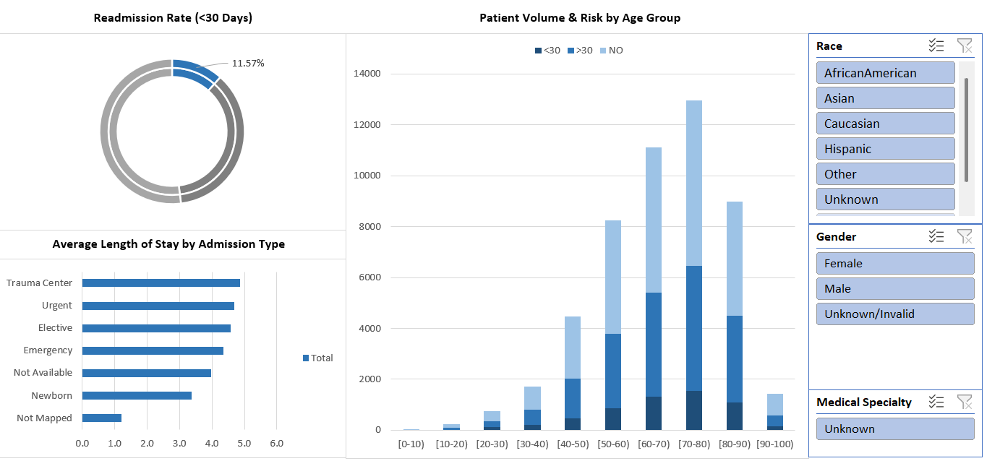

# Diabetes Readmission Analysis (Excel & Power Query)

 

## 📊 Executive Summary
This project analyzes **~100,000 patient records** from 130 US hospitals to identify factors contributing to high readmission rates among diabetic patients.

The final deliverable is an interactive **Excel Dashboard** that allows hospital administrators to filter patient risk profiles by Race, Gender, and Medical Specialty to optimize care transitions.

*(Note: Replace with your actual dashboard screenshot)*

---

## 💼 Business Problem
Hospital readmissions within 30 days are a primary quality metric for healthcare providers. High readmission rates can lead to financial penalties (CMS) and indicate gaps in post-discharge care.

**Goal:** Identify high-risk patient segments and operational bottlenecks (e.g., specific admission sources) to reduce the "Less than 30 Days" readmission rate.

---

## 🛠️ Technical Implementation

### Phase 1: Data Transformation (Power Query)
* **ETL Pipeline:** Built a robust query to extract and join data from multiple raw CSV sources (`diabetic_data.csv` and `IDs_mapping.csv`).
* **Data Cleaning:**
    * **Null Handling:** Identified non-standard missing values (`?`) and normalized them to "Unknown" using global value replacement.
    * **Data Typing:** Corrected "V-code" diagnosis columns (ICD-9) to **Text** to prevent Excel from interpreting medical codes as errors or decimals.
    * **Whitespace Removal:** Applied `Trim` and `Clean` functions to reference tables to ensure accurate relational joins.
* **Data Modeling:** Replaced brittle `VLOOKUP` functions with **Power Query Merges**, creating a Star Schema with 1 Fact Table (`Fact_Diabetes`) and 3 Dimension Tables (`Map_Admission`, `Map_Discharge`, `Map_Source`).

### Phase 2: Analysis & Visualization (Pivot Tables)
* **KPI Generation:** Calculated critical healthcare metrics:
    * **Readmission Rate (<30 Days):** **11.6%** (The primary risk metric).
    * **Average Length of Stay (ALOS):** **4.4 Days**.
    * **Patient Volume:** Stratified by age and admission source.
* **Interactivity:** Deployed Slicers with "Report Connections" to control multiple Pivot Charts simultaneously, allowing for deep-dive analysis into specific demographics (e.g., "Caucasian Females over 70").

---

## 📈 Key Insights
1.  **Demographic Risk:** The highest volume of readmissions occurs in the **[70-80] Age Group**, suggesting a critical need for targeted home-health support for elderly patients.
2.  **Operational Efficiency:** "Emergency" admissions have an Average Length of Stay of **4.3 days**, significantly higher than elective procedures, highlighting the impact of unplanned visits on bed capacity.
3.  **Readmission Alert:** While 54% of patients do not return, the **11.6%** who return within 30 days represent the highest-priority group for intervention.

---

## 📂 Project Structure
* `Diabete_Readmission_Portfolio.xlsx`: The main Excel workbook containing the raw data connection, Power Query steps, Pivot calculations, and final Dashboard.
* `data/`: (Optional) Folder containing the raw CSV files if you choose to upload them.

---

## 🚀 How to Use
1.  Download `Diabete_Readmission_Portfolio.xlsx`.
2.  Open the file (Enable Content if prompted).
3.  Navigate to the **Dashboard** sheet.
4.  Use the **Slicers** on the right to filter the entire view by Gender, Race, or Medical Specialty.
